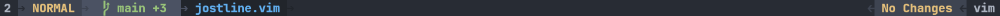
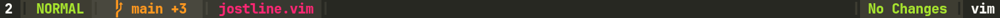
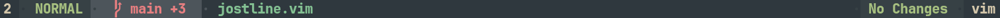

 

# vim-jostline

A fast, lightweight, and highly customizable statusline plugin for Vim (compatible with Vim 8+ and Vim 9). vim-jostline enhances your Vim experience by providing dynamic, informative, and visually appealing statusline updates.

---

## 🚀 Key Features

- ✅ **Automatic setup**: Initializes automatically on startup.
- ✅ **Git integration**: Displays current branch and file diff stats (`+added -removed`).
- ✅ **Dynamic theming**: Matches your Vim colorscheme automatically.
- ✅ **Customizable layout**: Easily configure the order and content of your statusline sections.
- ✅ **No dependencies**: Pure Vimscript implementation for fast performance.

---

## 📥 Installation

### Using vim-plug (Recommended)

```vim
call plug#begin('~/.vim/plugged')
Plug 'josstei/vim-jostline'
call plug#end()
```

Then reload Vim and run `:PlugInstall`.

### Using Pathogen

```bash
cd ~/.vim/bundle
git clone https://github.com/josstei/vim-jostline.git
```

---

## 🖼️ Setup Requirements

Ensure true color support is enabled:

```vim
if has('termguicolors')
  set termguicolors
endif
```

---

## ⚙️ Example Configuration

```vim
	" Left Section
	let g:jostline_left_section_1_active = { 'items': ['windowNumber']}
	let g:jostline_left_section_2_active = { 'items': ['mode'] }
	let g:jostline_left_section_3_active = { 'items': ['gitStats']}
	let g:jostline_left_section_4_active = { 'items': ['fileName']}

	let g:jostline_left_section_1_inactive = { 'items': ['windowNumber']}

	" Right Section
	let g:jostline_right_section_1_active = { 'items': ['fileType'] }
	let g:jostline_right_section_2_active = { 'items': ['modified'] }
	let g:jostline_right_section_3_active = { 'items': ['cursorPos'] }

	let g:jostline_right_section_1_inactive= { 'items': ['fileName'] }

	" Separator 
	let g:jostline_separator = 'triangle'
	let g:jostline_subseparator = 'dot'
```

---

## 📦 Available Statusline Items

| **Item**       | **Description**                                  |
|----------------|--------------------------------------------------|
| `mode`         | Vim mode (e.g., NORMAL, INSERT)                  |
| `fileName`     | Name of the current file                         |
| `fileType`     | File type (`&filetype`)                          |
| `filePath`     | Full path of the current file                    |
| `windowNumber` | Window number in Vim                             |
| `modified`     | Shows `[+]` if file has unsaved changes          |
| `gitStats`     | Git branch and diff stats (`+added -removed`)    |

---

## 🔧 Separator Configuration

Customize separators and sub-separators globally or per side.

### Global (Applies Everywhere)

```vim
let g:jostline_separator = 'triangle'
let g:jostline_subseparator = 'bar'
```

### Per-Side

```vim
let g:jostline_left_separator = 'rounded'
let g:jostline_right_separator = 'arrow'
let g:jostline_left_subseparator = 'dot'
let g:jostline_right_subseparator = 'bar'
```

### Mixed (Overrides)

```vim
let g:jostline_separator = 'triangle'
let g:jostline_right_separator = 'bar'
let g:jostline_subseparator = 'dot'
let g:jostline_right_subseparator = 'bar'
```

---

## 🧭 Resolution Priority

### Separator Resolution

| **Variable**                   | **Priority**         |
|--------------------------------|----------------------|
| `g:jostline_left_separator`    | Highest (per-side)   |
| `g:jostline_right_separator`   | Highest (per-side)   |
| `g:jostline_separator`         | Global fallback      |
| *(unset)*                      | Built-in default     |

### Sub Separator Resolution

| **Variable**                       | **Priority**         |
|------------------------------------|----------------------|
| `g:jostline_left_subseparator`     | Highest (per-side)   |
| `g:jostline_right_subseparator`    | Highest (per-side)   |
| `g:jostline_subseparator`          | Global fallback      |
| *(unset)*                          | Built-in default     |

---

## ✨ Available Separator Keywords

| **Keyword**      | **Font Requirement**             | **Preview**                      |
|------------------|----------------------------------|----------------------------------|
| `rounded`        | Powerline/Nerd Font              |  |
| `triangle`       | Powerline/Nerd Font              |  |
| `triangle_bold`  | Powerline/Nerd Font              |  |
| `arrow`          | None                             |  |
| `bar`            | None                             |  |
| `dot`            | None                             |  |

You can also set **custom symbols**:

```vim
let g:jostline_separator = '>'
let g:jostline_subseparator = '/'
```

---

## 🎨 Theme Support

Matches popular colorschemes automatically.

### Dark Themes

- gruvbox
- nord
- onedark
- dracula
- solarized
- monokai
- everforest
- catppuccin (mocha, latte, frappe, macchiato)
- PaperColor

### Light Themes

- PaperColor
- solarized

---

## 📝 License

MIT – see [LICENSE.md](LICENSE.md) for details.
