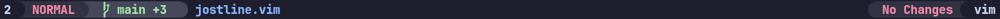
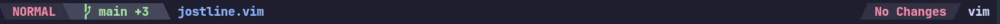
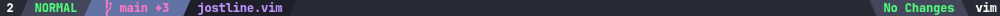

 

# vim-jostline

A fast, lightweight, and highly customizable statusline plugin for Vim (compatible with Vim 8+ and Vim 9). vim-jostline enhances your Vim experience by providing dynamic, informative, and visually appealing statusline updates.

---

## 🚀 Key Features

- ✅ **Automatic setup**: Initializes automatically on startup.
- ✅ **Git integration**: Displays current branch and file diff stats (`+added -removed`).
- ✅ **Dynamic theming**: Matches your Vim colorscheme automatically.
- ✅ **Customizable layout**: Easily configure the order and content of your statusline sections.
- ✅ **No dependencies**: Pure Vimscript implementation for fast performance.

---

## 📥 Installation

### Using vim-plug (Recommended)

Add to your `.vimrc`:

```vim
call plug#begin('~/.vim/plugged')
Plug 'josstei/vim-jostline'
call plug#end()
```

Then reload Vim and run:

```vim
:PlugInstall
```

### Using Pathogen

Clone directly into your Vim bundles:

```bash
cd ~/.vim/bundle
git clone https://github.com/josstei/vim-jostline.git
```

---

## 📋 Setup Requirements

For optimal experience, ensure your Vim supports true colors:

```vim
if has('termguicolors')
  set termguicolors
endif
```

---

## ⚙️ Customization Guide

vim-jostline is fully customizable via global Vim variables within your `.vimrc`

### 🔧 Separator and Sub Separator Configuration

Jostline allows you to fully customize the **separators** and **sub separators** for both the **left** and **right** sides of your statusline.

---

#### ✅ How to Set Separators and Sub Separators

You can configure **global** or **per-side** separators.

#### 1️⃣ Global (applies to both left and right)

Set this to apply the same separator everywhere:

```vim
let g:jostline_separator = 'triangle'
let g:jostline_subseparator = 'bar'

```

#### 2️⃣ Per-Side

Set each side independently:

```vim
let g:jostline_left_separator = 'rounded'
let g:jostline_right_separator = 'arrow'

let g:jostline_left_subseparator = 'dot'
let g:jostline_right_subseparator = 'bar'
```

#### 3️⃣ Mixed (global + side override)

Example: global default but override just one side.

```vim
let g:jostline_separator = 'triangle'
let g:jostline_right_separator = 'bar'

let g:jostline_subseparator = 'dot'
let g:jostline_right_subseparator = 'bar'
```

---

### 🔄 Resolution Order

#### Separators

| **Variable**                              | **Priority**             |
|-------------------------------------------|--------------------------|
| `g:jostline_left_separator`               | Highest (per-side)       |
| `g:jostline_right_separator`              | Highest (per-side)       |
| `g:jostline_separator`                    | Global fallback          |
| *(nothing set)*                           | Uses built-in default    |

### Sub Separators

| **Variable**                              | **Priority**             |
|-------------------------------------------|--------------------------|
| `g:jostline_left_subseparator`            | Highest (per-side)       |
| `g:jostline_right_subseparator`           | Highest (per-side)       |
| `g:jostline_subseparator`                 | Global fallback          |
| *(nothing set)*                           | Uses built-in default    |

---

### 🛠 Built-in Defaults

| **Type**          | **Default Keyword** | **Resolved Symbols (Left / Right)** |
|-------------------|---------------------|-------------------------------------|
| Separator         | `rounded`           | `` / ``                            |
| Sub Separator     | `dot`               | `·` / `·`                            |

---

### ✨ Available Separator Keywords

You can use the following **keywords** for both separators and sub separators.  
*(The plugin automatically picks the correct symbol for the left or right side based on where it's used.)*

| **Keyword**        | **Resolved Symbols (Left / Right)** | **Description**                                 | **Font Requirement**             |
|--------------------|-------------------------------------|-------------------------------------------------|----------------------------------|
| `rounded`          | `` / ``                            | Rounded separators (default)                    | Powerline/Nerd Font required     |
| `rounded_thin`     | `` / ``                            | Thin rounded separators                         | Powerline/Nerd Font required     |
| `triangle`         | `` / ``                            | Triangle shape                                  | Powerline/Nerd Font required     |
| `triangle_bold`    | `` / ``                            | Bold triangle                                   | Nerd Font required               |
| `arrow`            | `➔` / `←`                            | Unicode arrows                                  | Works with any font              |
| `bar`              | `|` / `|`                            | Simple bar                                      | Works with any font              |
| `doublebar`        | `||` / `||`                          | Double bar                                      | Works with any font              |
| `dot`              | `·` / `·`                            | Middle dot (default sub separator)              | Works with any font              |
| `equals`           | `=` / `=`                            | Equals sign                                     | Works with any font              |


`rounded` *(Powerline/Nerd Font required)*



`triangle` *(Powerline/Nerd Font required)*



`triangle_bold` *(Powerline/Nerd Font required)*



---

### 📝 Notes

- **Powerline/Nerd Font symbols:**  
  To use separators like `rounded`, `triangle`, or `triangle_bold`, you'll need a **Powerline-patched or Nerd Font.**  
  Popular options include:
  - [FiraCode Nerd Font](https://github.com/ryanoasis/nerd-fonts)
  - [Hack Nerd Font](https://github.com/ryanoasis/nerd-fonts)
  - [JetBrains Mono Powerline](https://www.jetbrains.com/lp/mono/)

- **Fallback:**  
  If you don't set any separator, Jostline will use its built-in defaults:
  - **Separator:** `rounded`
  - **Sub Separator:** `dot`

- **Direct Symbols:**  
  You can also set the variable to a **custom symbol** instead of a keyword:

  ```vim
  let g:jostline_separator = '>'
  let g:jostline_subseparator = '/'
  ```

### Statusline Sections

Sections are organized using global variables with the format:

```vim
g:jostline_<side>_section_<number>_<status>
```

- `<side>`: `left` or `right`
- `<number>`: order of sections (`1`, `2`, ...)
- `<status>`: `active` (focused window) or `inactive` (unfocused window)

#### Items Available - More Coming Soon!:

- `mode`: Vim mode (e.g., NORMAL, INSERT)
- `fileName`: Name of the current file
- `fileType`: File type (`&filetype`)
- `filePath`: Path of the current file
- `windowNumber`: Window number in Vim
- `modified`: Shows `[+]` if the file has unsaved changes
- `gitStats`: Current Git branch and diff stats

Example Configuration:

```vim
" Left Section
let g:jostline_left_section_1_active = { 'items': ['windowNumber'], 'highlight': {'fg': '#000000','bg': '#c678dd'}}
let g:jostline_left_section_2_active = { 'items': ['mode'], 'highlight': {'fg': '#ffffff','bg': '#4b2a55'}}
let g:jostline_left_section_3_active = { 'items': ['gitStats'], 'highlight': {'fg': '#ffffff','bg': '#333333'}}
let g:jostline_left_section_4_active = { 'items': ['fileName'], 'highlight': {'fg': '#000000','bg': '#c678dd'}}

" Right Section
let g:jostline_right_section_1_active = { 'items': ['fileType'], 'highlight': {'fg': '#000000','bg': '#c678dd'}}
let g:jostline_right_section_2_active = { 'items': ['modified'], 'highlight': {'fg': '#ffffff','bg': '#4b2a55'}}

```

---

## 🎨 Built-in Theme Support

vim-jostline automatically recognizes and matches colors with popular themes:

- **Dark Themes**:
  - gruvbox
  - nord
  - onedark
  - dracula
  - solarized_dark
  - monokai
  - everforest
  - catppuccin ( mocha, latte, frappe, macchiato)

- **Light Themes**:
  - papercolor_light

## 📝 License

This project is licensed under the MIT License. See [LICENSE.md](LICENSE.md) for full details.
